<!--
  Every image under assets/ is drawn by scripts/build_assets.py (edit the text there, then re-run it).
  The activity, language and snake cards are rebuilt by .github/workflows/profile.yml and live on the `output` branch.
-->


 

**Second-year CSE student on the data science track, building full-stack products with AI layered in.** 
Python · TypeScript · C++ · machine learning · data visualisation · Jalandhar, Punjab

 



  


<a href="https://github.com/Deepak17kb/BroadBridge"></a>
<a href="https://github.com/Deepak17kb/NER-SafeRoute"></a>
<a href="https://github.com/Deepak17kb/AgriFlow"></a>
<a href="https://github.com/Deepak17kb/KrishiMitra"></a>
<a href="https://github.com/Deepak17kb/Automated-Deadlock-Detection-Tool"></a>
<a href="https://github.com/Deepak17kb/Global-Jobs-Hiring-Analytics"></a>

Cards open the repository · live demos:
<a href="https://deepak17kb.github.io/BroadBridge/">BroadBridge</a> ·
<a href="https://ner-safe-route-psi.vercel.app">NER SafeRoute</a> ·
<a href="https://agriflowai.streamlit.app">AgriFlow AI</a> ·
<a href="https://deepak17kb.github.io/Automated-Deadlock-Detection-Tool/">Deadlock Runtime Lab</a>

<b>More builds</b>

 

| Project | What it does | Built with |
|:--|:--|:--|
| [Gesture Rex](https://github.com/Deepak17kb/Rex-Gesture-Game) | Plays the Chrome dino game from hand gestures seen by a webcam | Python · MediaPipe |
| [Voice assistant](https://github.com/Deepak17kb/Speech-Reco-Model) | Listens through the microphone, recognises speech and answers aloud | Python |
| [Movie dataset EDA](https://github.com/Deepak17kb/Movie-Dataset-Exploratory-Data-Analysis-EDA-) | Genres, ratings, budgets and profitability, explored visually | Python · Jupyter |
| [La Perla](https://github.com/Deepak17kb/La_Perla) | Luxury real-estate landing page with glassmorphism and smooth motion | HTML · CSS · JavaScript |

 


| | |
|:--|:--|
| **Languages** |  |
| **Web & APIs** |  |
| **ML & data** |      |
| **Visualisation** |      |
| **Tooling** |  |

Foundations: data structures · algorithms · database systems · object-oriented programming · operating systems

  


<picture>
  <source media="(prefers-color-scheme: dark)" srcset="https://raw.githubusercontent.com/Deepak17kb/Deepak17kb/output/snake-dark.svg"/>
  <source media="(prefers-color-scheme: light)" srcset="https://raw.githubusercontent.com/Deepak17kb/Deepak17kb/output/snake-light.svg"/>
  
</picture>

  


<a href="https://github.com/Deepak17kb"></a>

  


