<!--
  Every image under assets/ is drawn by scripts/build_assets.py (edit the text there, then re-run it).
  The activity, language and snake cards are rebuilt by .github/workflows/profile.yml and live on the `output` branch.
-->

 

**CSE student on the data science track, turning messy data into meaningful insights with AI layered in.** 
Python · SQL · machine learning · Power BI · data visualisation · Jalandhar, Punjab

 

  

Cards open the repository · live demos:
<a href="https://deepak17kb.github.io/BroadBridge/">BroadBridge</a> ·
<a href="https://ner-safe-route-psi.vercel.app">NER SafeRoute</a> ·
<a href="https://adityashukla2615.github.io/upi-risk-desk/outputs/upi_risk_desk.html?v=2">UPI Risk Desk</a> ·
<a href="https://agriflowai.streamlit.app">AgriFlow AI</a> ·
<a href="https://deepak17kb.github.io/Automated-Deadlock-Detection-Tool/">Deadlock Runtime Lab</a>

<b>More builds</b>

 

| Project | What it does | Built with |
|:--|:--|:--|
| [Hiring Analytics](https://github.com/Deepak17kb/Global-Jobs-Hiring-Analytics) | Power BI dashboard on global hiring trends, salaries and workforce insights | Power BI |
| [Gesture Rex](https://github.com/Deepak17kb/Rex-Gesture-Game) | Plays the Chrome dino game from hand gestures seen by a webcam | Python · MediaPipe |
| [Voice assistant](https://github.com/Deepak17kb/Speech-Reco-Model) | Listens through the microphone, recognises speech and answers aloud | Python |
| [Movie dataset EDA](https://github.com/Deepak17kb/Movie-Dataset-Exploratory-Data-Analysis-EDA-) | Genres, ratings, budgets and profitability, explored visually | Python · Jupyter |
| [La Perla](https://github.com/Deepak17kb/La_Perla) | Luxury real-estate landing page with glassmorphism and smooth motion | HTML · CSS · JavaScript |

 

| | |
|:--|:--|
| **Data & SQL** |     |
| **AI & ML** |    |
| **BI & visualisation** |      |
| **Languages** |  |
| **Build & ship** |  |

Foundations: data structures · algorithms · database systems · object-oriented programming · operating systems

  

<picture>
  <source media="(prefers-color-scheme: dark)" srcset="https://raw.githubusercontent.com/Deepak17kb/Deepak17kb/output/snake-dark.svg"/>
  <source media="(prefers-color-scheme: light)" srcset="https://raw.githubusercontent.com/Deepak17kb/Deepak17kb/output/snake-light.svg"/>
  
</picture>

  

  

